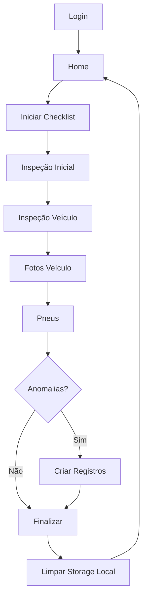

# 🎯 Visão Geral do Sistema

[← Voltar ao Índice](./index.md)

---

## 📖 Descrição

O **Checklist Veicular** é um aplicativo móvel desenvolvido para realizar inspeções detalhadas de veículos de frota. O sistema oferece uma solução completa desde a captura de dados em campo até a gestão administrativa com métricas e relatórios.

---

## 🎯 Objetivo

Facilitar e padronizar o processo de inspeção veicular, permitindo:

- ✅ Inspeções guiadas passo a passo
- 📸 Documentação fotográfica de defeitos
- 🔄 Sincronização automática de dados
- 📊 Acompanhamento de anomalias
- 📈 Métricas e análises de frota

---

## 👥 Perfis de Usuário

### 1. Inspetor
**Responsabilidades:**
- Realizar inspeções de veículos
- Capturar fotos de defeitos
- Registrar anomalias
- Completar checklists

**Acesso:**
- Tela de Login
- Tela Home
- Fluxo de Inspeção (Inicial → Veículo → Fotos → Pneus)
- Checklist Completo

### 2. Administrador
**Responsabilidades:**
- Visualizar histórico de inspeções
- Gerenciar anomalias (aprovar/reprovar/finalizar)
- Configurar itens de inspeção
- Analisar métricas e estatísticas

**Acesso:**
- Tela de Login
- Dashboard Admin (Histórico, Anomalias, Configuração, Métricas)

---

## 🏗️ Arquitetura do Sistema

### Frontend (Mobile)
```
┌─────────────────────────────────────┐
│     Ionic 8 + Angular 20            │
│  (TypeScript - Interface Mobile)    │
├─────────────────────────────────────┤
│  📱 Páginas                          │
│  - Login, Home, Inspeções, Admin    │
│                                      │
│  🔧 Serviços                         │
│  - API, Auth, Storage, Camera       │
│                                      │
│  📦 Capacitor Plugins                │
│  - Camera, Preferences, FileSystem  │
└─────────────────────────────────────┘
```

### Backend (API)
```
┌─────────────────────────────────────┐
│          PHP + MySQL                 │
│     (API RESTful - PDO)             │
├─────────────────────────────────────┤
│  🔌 Endpoints                        │
│  - Auth, Checklists, Anomalias      │
│  - Configuração, Placas             │
│                                      │
│  💾 Banco de Dados                   │
│  - MySQL/MariaDB                    │
└─────────────────────────────────────┘
```

### Comunicação
```
Mobile App ←─ HTTPS/JSON ─→ API PHP ←─ PDO ─→ MySQL
     │                                          │
     └────── Capacitor Preferences ─────┘
            (Storage Local)
```

---

## 📊 Fluxo de Dados

### 1. Armazenamento Local (Offline First)
- Dados salvos localmente durante inspeção
- Permite trabalho sem conexão
- Sincronização quando disponível

### 2. Sincronização com Backend
- Envio automático de dados completos
- Confirmação de recebimento
- Limpeza de dados locais após sucesso

### 3. Gestão de Anomalias
- Detecção automática de itens "ruins"
- Criação de registros de anomalias
- Fluxo de aprovação/reprovação

---

## 🛠️ Tecnologias Utilizadas

### Frontend
| Tecnologia | Versão | Uso |
|------------|--------|-----|
| **Ionic** | 8 | Framework mobile |
| **Angular** | 20 | Framework web |
| **TypeScript** | Latest | Linguagem |
| **Capacitor** | 7 | Plugins nativos |
| **Chart.js** | 4.4 | Gráficos |
| **Driver.js** | 1.x | Tours guiados |
| **jsPDF** | Latest | Geração de PDF |

### Backend
| Tecnologia | Uso |
|------------|-----|
| **PHP** | API RESTful |
| **MySQL/MariaDB** | Banco de dados |
| **PDO** | Conexão segura com DB |
| **phpMyAdmin** | Administração DB |

### Plugins Capacitor
```typescript
@capacitor/camera         // Captura de fotos
@capacitor/preferences    // Storage local
@capacitor/filesystem     // Sistema de arquivos
@capacitor/network        // Status de conexão
```

---

## 📱 Tipos de Inspeção

### Checklist Simples
**Uso:** Veículos comuns (carros, vans)

**Etapas:**
1. Inspeção Inicial (placa, km, combustível)
2. Inspeção Veículo (motor, elétrico, limpeza, ferramentas)
3. Fotos Veículo (4 ângulos obrigatórios)
4. Pneus (condição e pressão)

**Tempo médio:** 10-15 minutos

### Checklist Completo
**Uso:** Veículos pesados (ônibus, caminhões)

**Etapas:**
1. Dados Iniciais
2. Parte 1 - Interna (buzina, cintos, espelhos)
3. Parte 2 - Equipamentos (extintor, ferramentas)
4. Parte 3 - Dianteira (faróis, pneus, para-choque)
5. Parte 4 - Traseira (lanternas, pneus, para-choque)
6. Parte 5 - Veículos Pesados (certificados, fumaça)

**Tempo médio:** 20-30 minutos

---

## 🔄 Ciclo de Vida de uma Inspeção



---

## 📦 Estrutura de Diretórios

```
/home/user/checklist-app/
├── src/
│   ├── app/
│   │   ├── pages/                    # Telas do app
│   │   │   ├── login/
│   │   │   ├── home/
│   │   │   ├── inspecao-inicial/
│   │   │   ├── inspecao-veiculo/
│   │   │   ├── fotos-veiculo/
│   │   │   ├── pneus/
│   │   │   ├── admin/
│   │   │   └── checklist-completo/
│   │   ├── services/                 # Serviços
│   │   │   ├── api.service.ts
│   │   │   ├── auth.service.ts
│   │   │   ├── checklist-data.service.ts
│   │   │   └── ...
│   │   ├── models/                   # Modelos de dados
│   │   │   └── checklist.models.ts
│   │   ├── config/                   # Configurações
│   │   │   └── app.constants.ts
│   │   └── doc/                      # 📚 Documentação
│   ├── assets/                       # Recursos estáticos
│   └── environments/                 # Variáveis de ambiente
├── api/                              # Backend PHP
│   ├── b_veicular_auth.php
│   ├── b_veicular_set.php
│   ├── b_veicular_get.php
│   └── ...
└── package.json
```

---

## 🔐 Segurança

### Autenticação
- Login local com usuário/senha
- Integração com Microsoft Azure OAuth
- Tokens de sessão
- Validação de perfil (admin/inspetor)

### Armazenamento
- Senhas não armazenadas em plain text
- Tokens em Capacitor Preferences (criptografado)
- Comunicação via HTTPS

### Validação
- Validação de placas no banco de dados
- Verificação de campos obrigatórios
- Sanitização de inputs

---

## 📊 Métricas e Estatísticas

O sistema coleta e exibe:

- ✅ Total de inspeções realizadas
- ⚠️ Anomalias ativas/finalizadas
- 🚗 Veículos inspecionados
- 📅 Inspeções hoje/semana
- 📈 Taxa de aprovação
- 🏆 Top veículos com problemas
- 📊 Categorias com mais defeitos

---

## 🎨 Interface e Experiência

### Design
- Interface limpa e intuitiva
- Cores indicativas de status
- Feedback visual imediato
- Responsivo para tablets e smartphones

### Acessibilidade
- Tutorial na primeira utilização
- Validações em tempo real
- Mensagens de erro claras
- Confirmações antes de ações críticas

### Performance
- Compressão de imagens (45% qualidade)
- Lazy loading de rotas
- Cache de dados (5 minutos)
- Carregamento progressivo

---

## 🚀 Funcionalidades Destacadas

### 1. Captura e Anotação de Fotos
- Desenho sobre fotos
- Marcação de defeitos
- Cores e espessuras customizáveis
- Zoom e pan

### 2. Trabalho Offline
- Salvamento local automático
- Sincronização quando online
- Retomada de inspeções

### 3. Sistema de Anomalias
- Detecção automática
- Rastreamento de status
- Fluxo de aprovação
- Notificações

### 4. Configuração Dinâmica
- Adicionar/remover itens
- Habilitar/desabilitar categorias
- Personalização por tipo de frota

### 5. Rastreamento de Tempo
- Tempo por tela
- Tempo total de inspeção
- Análise de eficiência

---

## 📞 Informações de Contato

- **API Base URL**: `https://floripa.in9automacao.com.br`
- **Repositório**: `/home/user/checklist-app`
- **Documentação**: `/src/doc/`

---

## 📚 Próximos Passos

1. [Entender o fluxo de dados completo](./10-fluxo-dados.md)
2. [Explorar a tela de Login](./02-login.md)
3. [Conhecer o fluxo de inspeção](./04-inspecao-inicial.md)
4. [Aprender sobre a área administrativa](./08-admin.md)

---

[← Voltar ao Índice](./index.md)
